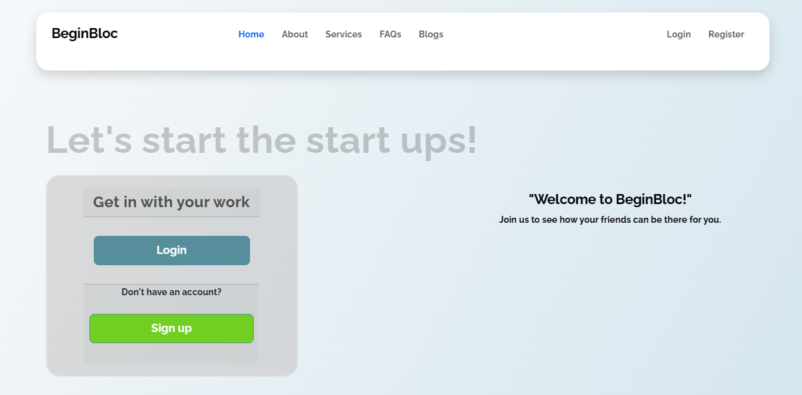
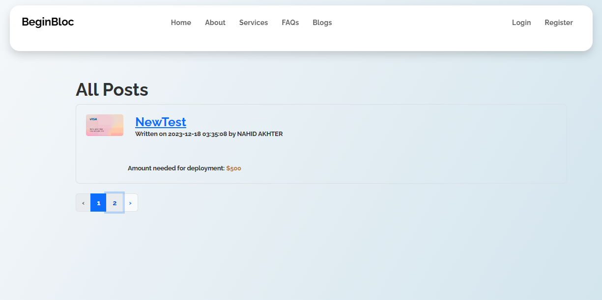
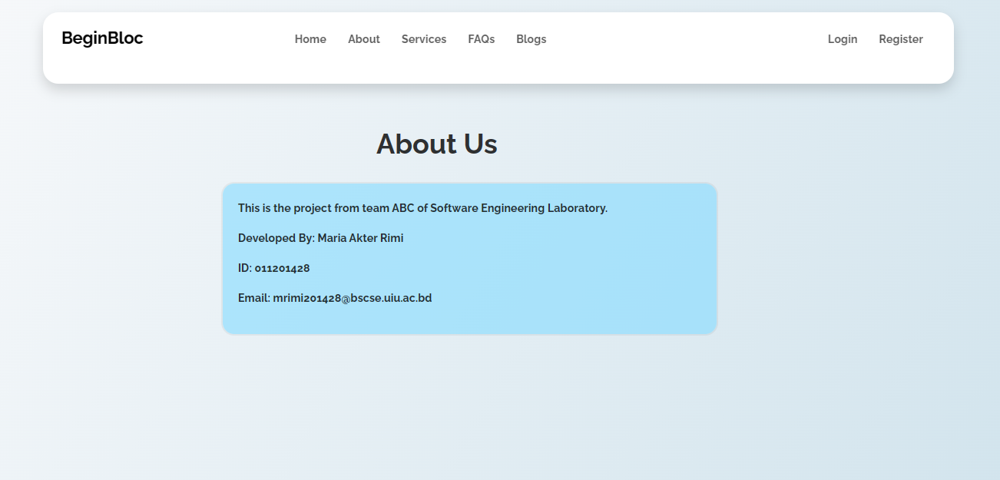

# Welcome to BeginBloc User guide

This is the user manual of how to use BeginBloc website, created by team ABC.

## Introduction

BeginBloc was created with the idea to help the small start up companies to introduce themselves in the market as well as to gather fundings for their project and create a network. The uniqueness of each project is what attracts the potential users and the commitment is what binds the trust upon the developers. Therefore, here's a guide of how you could utilize this website being a developer or an investor.

### Homepage

We kept the design very minimalistic thus it is more understandable to the users. 

After going to website, at first you will encounter this page.

### Register
If you do not have an account and want to register, then you can either click on 'Register' from navbar or 'Sign up' to create one. 

After clicking, these page will appear to you. You have to fill the necessary fields to create an account and press 'Register'. That's how easily you can create your account!

### Login

Now that you have an account, you can easily enter to your account simply by just giving the email and password. If you have forgotten your password, you can recover that too by clicking 'Forgot your password?'. 

### Dashboard

After login, the first page you encounter is the dashboard. You can create your posts as well as edit, delete and checking the responses of your each created posts.

### Create Post

You can create a post either from your dashboard, or from your 'Blogs' option in the navbar.

N.B: Only the registered accounts can create a post.

The option of editing post is exactly the same. 

### Responses

When you successfully create a post and any potential investors shows interest to contribute to your project, you will get that in the responses option. The number of investors' responses will be seen in a (bracket) in your dashboard, beside each posts.

After clicking on response, you can see the details of the investor along with the amount he can contribute.

### Blogs

From the navbar, if you click on thi button, it will take you too the page where all the posts posted by different users for funds will be seen.

If you click on your own post, there you will see the 'Edit' and 'Delete' button only, as you cannot contribute to your own project.

Nevertheless, if you click on someone else's post, you can see the option of 'Contribute' instead of 'Edit' and 'Delete'.

### Contribute

From the post, if you click to contribute, you will be taken to this page. Here, by clicking any percentage, it will calculate the estimated amount that you have to give to the project. If you agree with the terms and condition then you can contribute to the project by clicking 'Submit'. 

A confirmation dialogue will assure you contribution confirmation.

### The navbar

The navbar's design is very simple, still the manual of each of the link it has will be described in the guest section. For your own account, at the very right of the navbar, if you click to your name, you can see these options.

### Guest

 If you are a guest, you might need to create an account by clicking either 'Sign up' or 'Register' from the navbar to create an account. 

Otherwise, what can you see being a guest is described below-

**1. About page**
   
   Here you can see the details of the developers and how to contact them.

   

**2. Services page**

You can see the provided services by this website.

**3. FAQs**

Here, the FAQs about the websites are given. If you do not find your relatable question here, you can always contact the developers.

**4. Blogs**

Being a guest user, you can see the posts that need funds for deployment.

 However, you cannot create, edit, delete and contribute to any post. For that, you must have an account.

This was the manual for BeginBloc. We hope that it was helpful for you. If you still got any problem, we request to contact the team ABC. 

## Thank You!
